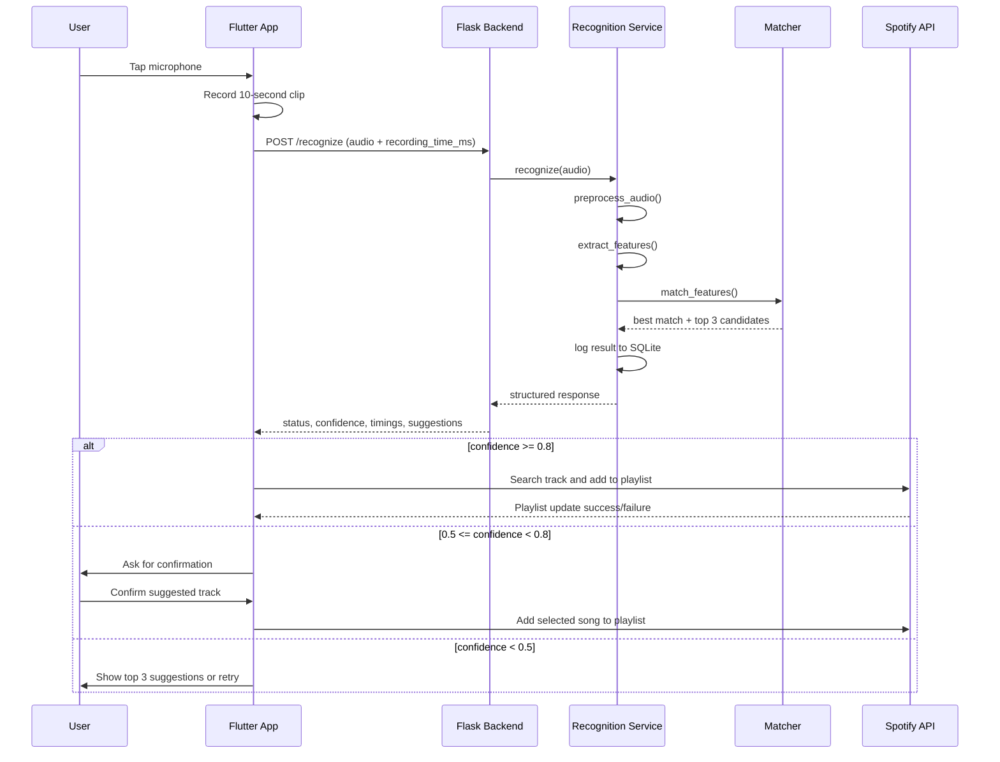

# System Architecture

```mermaid
flowchart LR
    A[Flutter App] --> B[Audio Capture Service]
    B --> C[Backend API Service]
    C --> D[/recognize Flask Route]
    D --> E[Recognition Service]
    E --> F[Audio Preprocessing]
    F --> G[Feature Extraction]
    G --> H[Song Matcher]
    H --> I[(Feature Matrix)]
    E --> J[(SQLite Logs)]
    E --> K[Structured JSON Response]
    K --> A
    A --> L[Spotify Auth Service]
    L --> M[Spotify Playlist Service]
    M --> N[Spotify Web API]
```

# Sequence Flow


